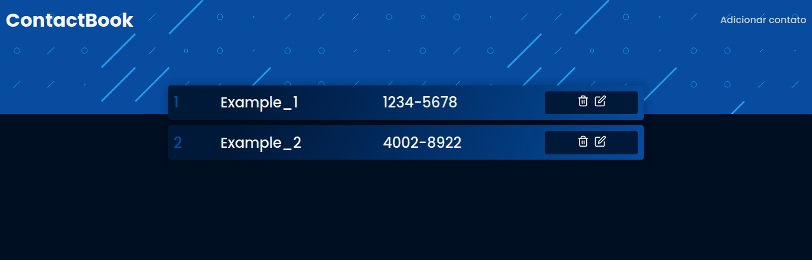

# ContactBook




---

## 🔖 Tabela de Conteúdo

- [📕 Sobre](#📕-sobre)
- [⚒️ Tecnologias Utilizadas](#⚒️-tecnologias-utilizadas)
- [✨ Features](#✨-features)
- [⚙️ Como utilizar](#⚙️-como-utilizar)
- [🧑‍🎓 O Que Aprendi](#🧑‍🎓-o-que-aprendi)
- [🤝 Seja um Contribuidor](#🤝-seja-um-contribuidor)
- [🔓 Licença](#🔓-licença)

---

## 📕 Sobre

ContactBook é uma agenda de contatos, que te permite criar, visualizar, editar e
apagar contatos. Como banco de dados, ContactBook utiliza SQLite3.

---

## ⚒️ Tecnologias Utilizadas

Para desenvolver esta aplicação, utilizei as seguintes tecnologias:

- HTML5
- CSS3
- Javascript
- ExpressJS
- EJS
- SQLite3
- Webpack

---

## ✨ Features

- CRUD de contatos
- Responsividade
- Salvamento de dados na base de dados SQLite3

---

## ⚙️ Como utilizar

Primeiro, baixe os arquivos do projeto ou clone-o em sua máquina. Em seguinda,
instale as dependências do projeto:

```
npm install/npm i
```

Agora, é necessário criar o arquivo sqlite que será utilizado como banco de
dados do projeto:

```
npm run db
```

Por último, utilize o comando abaixo sempre que quiser rodar o servidor.

```
npm start
```

O projeto também possui um arquivo de configuração do webpack, bem como um
script para rodá-lo. Enquanto estiver modificando os arquivos Javascript
estáticos do projeto, pasta src/scripts, deixe o comando abaixo rodando, para
atualizar o bundle.js que está dentro da pasta public/dist:

```
npm run build
```

Feito isto, é só utilizar.

---

## 🧑‍🎓 O que aprendi

Este projeto foi minha segunda experiência com Express e EJS, logo após terminar
a segunda edição da Maratona Discover, da Rocketseat. Então, como forma de
aprendizado e fixação, resolvi criar uma aplicação similar do zero, seguindo os
conhecimentos que adquiri.

Nunca tive experiência com bancos de dados relacionais, e criando este projeto,
pude perceber que, de fato, não são nenhum monstro de sete cabeças, muito pelo
contrário, são intuitivas. Falando especificamente do SQLite3, é bem simples e
direto ao ponto. No geral, foi uma ótima experiência utilizando-o.

Na stack de tecnologias utilizadas, também está o ExpressJS, um framework em
Node para criação de servidores. Já havia experimentado o Express em alguns
outros projetos menores, a maioria apenas para aprendizado. Neste projeto, pude
colocar em prática tudo que aprendi, desde Middlwares até o funcionamento das
rotas, sendo tudo muito intuitivo e simples de utilizar, justamente por ser um
framework. E lado a lado com o Express, está o EJS.

EJS, uma template engine para programar Javascript dentro do HTML, foi muito
divertido de utilizar. Sua simplicidade permitiu abstrair diversos passos comuns
de um projeto como esse, como a criação de funções/objetos somente para
estruturar o elemento a ser criado para cada elemento de um array. Desse modo, o
código pôde ficar mais limpo e direto ao ponto.

Além das novas tecnologias, este projeto também foi uma ótima experiência
utilizando o padrão de projeto MVC, Model-View-Controller. Definindo funções
únicas e objetivas para cada um dos elementos do projeto (base de dados, EJS e
Express), o código pôde ficar muito bem organizado. Além disso, o fato de ser um
novo padrão de projeto já me causou ânimo.

No mais, foi um projeto que rendeu muitos frutos, e que me permitiu colocar em
prática diversas tecnologias que nunca havia utilizado de fato, e utilizar um
padrão de projeto que também nunca havia utilizado. Como disse anteriormente,
fiz o projeto para fixar os conhecimentos adquiridos durante a segunda edição da
Maratona Discover. Se quiser conhecer mais sobre a Rocketseat, pode clicar [aqui](https://rocketseat.com.br/).

## 🤝 Seja um contribuidor

Tem alguma ideia que poderia alavancar ainda mais o projeto, e deseja implementar? É simples!

1. Faça fork do proketo
2. Modifique o que achar necessário
3. Faça o commit das mudanças
4. Crie um Pull Request

---

## 🔓 Licença

Este projeto está sob licensa MIT. Clique [aqui](./.github/LICENSE) para mais detalhes.
